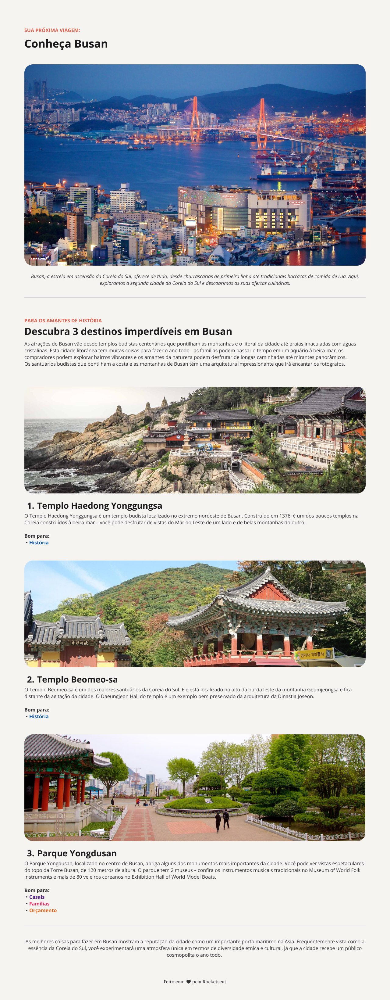

  <h1 align="center">Desafio Prático: Local Turístico 🏖️📸</h1>

## ✏️ Sobre

> Esse é o primeiro desafio prático do curso Full-Stack da Rocketseat. 
Nesse desafio precisei desenvolver uma página web com informações sobre um determinado local turístico.  
Trabalhei conceitos como: Estrutura HTML, estilização com CSS, fontes, espaçamentos, imagens, listas desordenadas, alterações das cores dos textos, alterações dos pesos dos textos.📝🚀

## ⚙ Tecnologias

 

  
  

 

## 🎨 Layout

Para acessar o Design no Figma, click no link abaixo:

🔗 [View on Figma](https://www.figma.com/community/file/1384542229391733447/local-turistico)

## 📫 Contato

  
  
  

 

<h4 align="center">Feito com 💙 por Julianna D. Alencar 👋🏻</h4>